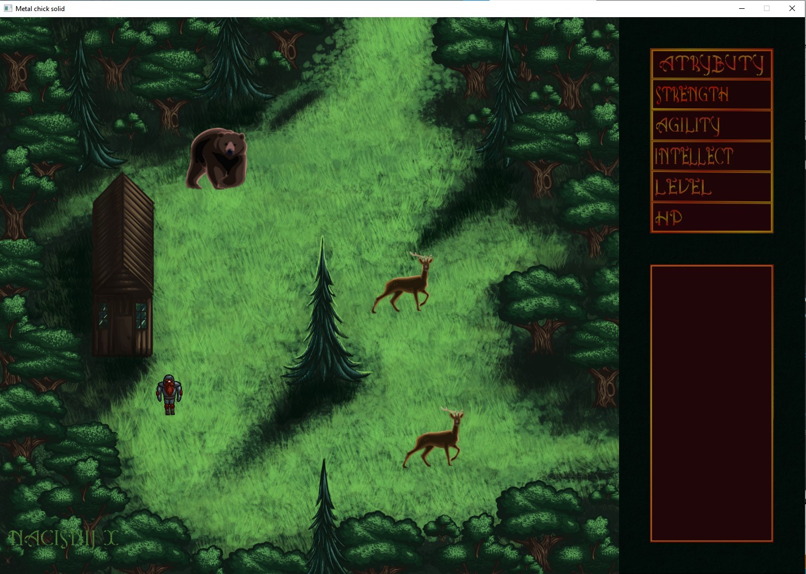
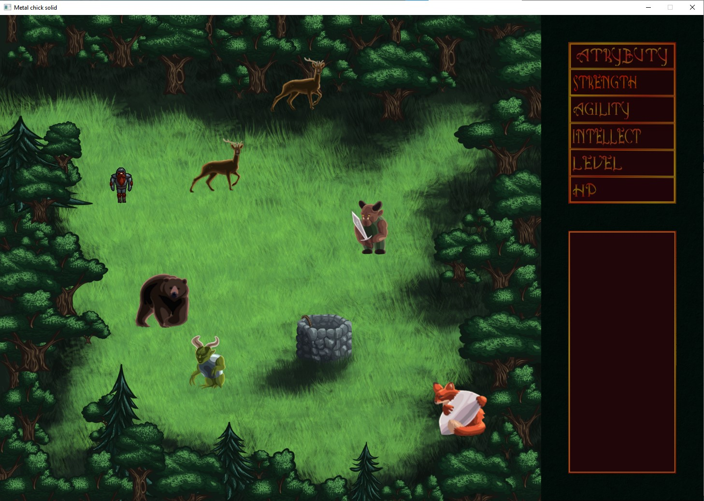
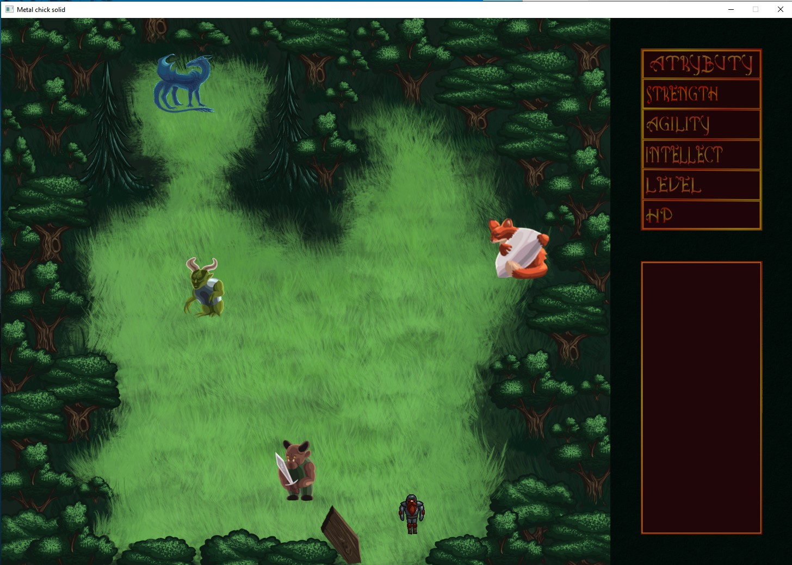
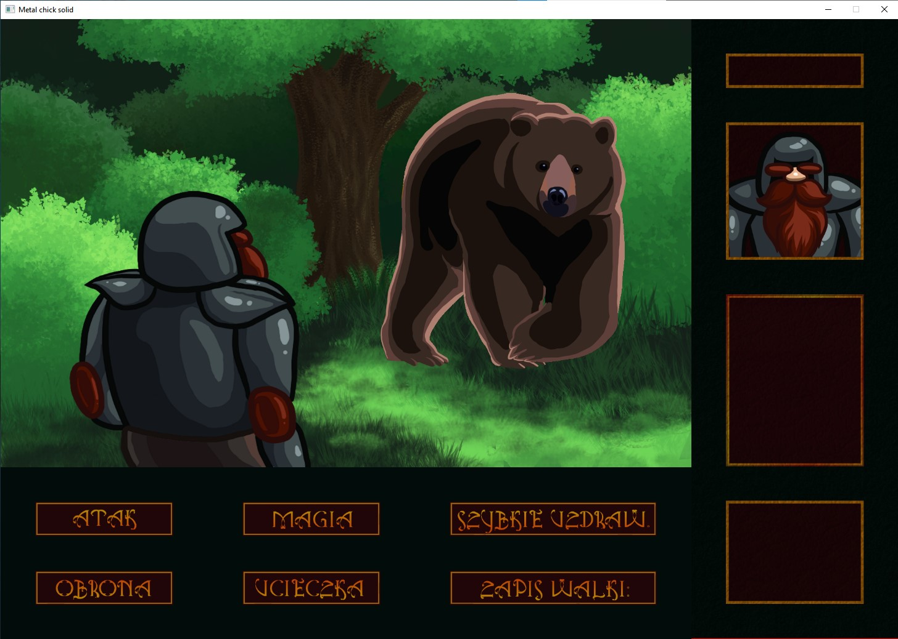
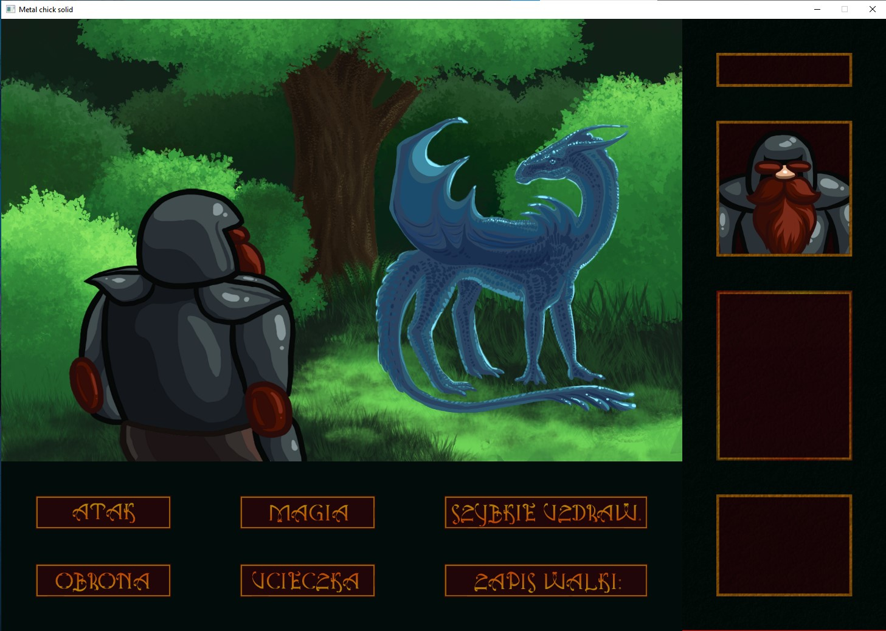

# Metal chick solid  Based on [SFML](https://www.sfml-dev.org/)
## It is a school team project. 
Written in C++ basicaly in 2 week (╯°□°）╯︵ ┻━┻.
### To run in Visual studio, set values (required values are listed below).  Images and other informations: ["Creating and configuring a SFML project"](https://www.sfml-dev.org/tutorials/2.5/start-vc.php#creating-and-configuring-a-sfml-project). 
#### Add values into project properties: 
  (<b>ALL CONFIGURATIONS</b>) C/C++ -> General -> Additional headers -> General: 
  $(SolutionDir)\SFML-2.5.1\include;%(AdditionalIncludeDirectories)  
  (<b>ALL CONFIGURATIONS</b>) Linker -> Additional Library Directories: 
  $(SolutionDir)\SFML-2.5.1\lib;%(AdditionalLibraryDirectories)  
  (<b>RELEASE</b>) Linker -> Input:  
  sfml-system.lib; sfml-window.lib; sfml-graphics.lib; sfml-audio.lib; kernel32.lib;user32.lib;gdi32.lib;winspool.lib;comdlg32.lib;advapi32.lib;shell32.lib;ole32.lib;oleaut32.lib;uuid.lib;odbc32.lib;odbccp32.lib;%(AdditionalDependencies)  
  (<b>DEBUG</b>) Linker -> Input: 
  sfml-system-d.lib; sfml-window-d.lib; sfml-graphics-d.lib; sfml-audio-d.lib;kernel32.lib;user32.lib;gdi32.lib;winspool.lib;comdlg32.lib;advapi32.lib;shell32.lib;ole32.lib;oleaut32.lib;uuid.lib;odbc32.lib;odbccp32.lib;%(AdditionalDependencies) 
#### Set c++ version to latest: Project -> Properties -> General -> c++ standard: /std:c++latest

# Gameplay:
## Maps

## Walking

## Fight

